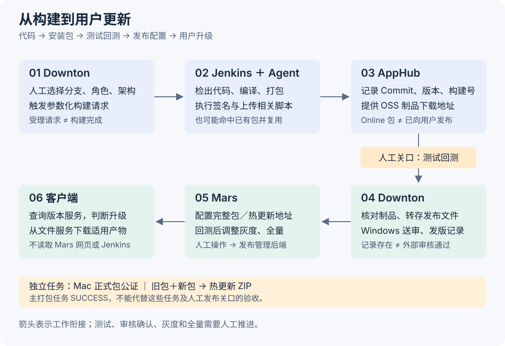
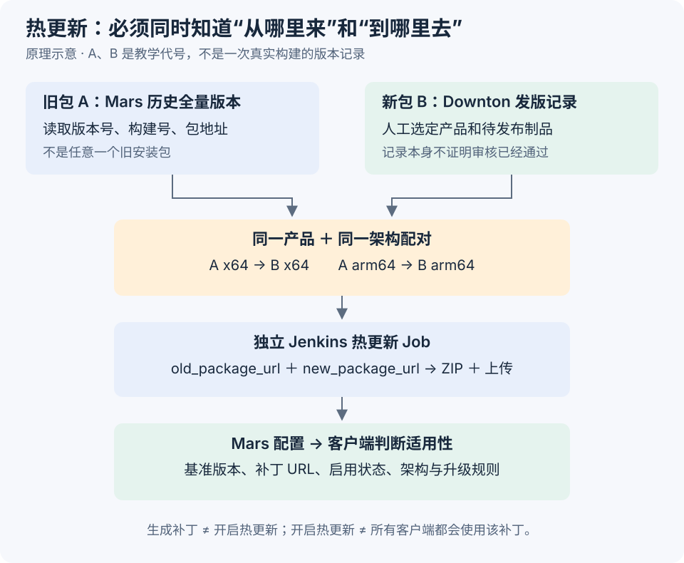

# 发布流程

桌面端发一个版本，要先把代码构建成安装包，再把安装包交给测试，最后配置用户如何升级。这里按实际顺序介绍这条流程，以学生端 Mac 为主要例子，并说明 Windows 的不同之处。

本文依据 2026-09-21 核对的页面、构建配置、项目源码和发版文档整理。下面的演示只在浏览器内运行，不会连接公司平台。

## 一、先看整个流程

| 平台 | 在发布过程中做什么 |
| --- | --- |
| Downton | 选择参数并发起构建；导入安装包、转存 CDN、提交 Windows 审核；记录发版信息并发起热更新任务 |
| Jenkins | 把任务分配给构建机，运行编译、打包、上传等脚本；Mac 公证和热更新各有独立 Job |
| AppHub | 保存、展示构建记录和制品地址，供开发与测试查找对应的包 |
| Mars | 配置版本、完整包和热更新地址，控制灰度比例、全量发布与最低支持版本 |

**打包完成时，得到的是文件；发布完成时，用户才会按升级规则收到新版本。** 文件实际由 OSS／CDN 提供下载，客户端通过版本服务获取升级信息。



## 二、一步一步操作演示

先选一个 Mac 架构，再点击蓝色按钮推进。上方显示走到哪个环节，中间解释当前操作，下方的构建记录、文件和发布状态会随步骤变化。

这个例子演示“没有可复用旧包，需要重新构建”的正式包主线。版本号和构建号是示意数据；公证与人工回测按阅读顺序展开，不代表真实平台把它们串成一个自动流水线。

{{"demo":"desktop-release-flow"}}

## 三、发起构建：把要打什么包说清楚

### 1. 确定代码、产品和架构

开发先确定本次要发布的提交，以及要构建的产品、平台和架构。例如学生端 Mac ARM64 正式包，需要以下参数：

| 参数 | 示例 | 作用 |
| --- | --- | --- |
| `BUILD_TYPE` | `ONLINE` | 正式包；测试包使用 `TEST` |
| `Branch` | `feature-electron12` | Jenkins 从该分支检出代码 |
| `USER_ROLE` | `student` | 选择学生端配置；同一个 Job 还支持其他角色 |
| `arch` | `arm64` | 构建 Apple Silicon 原生包；Intel 路径为 `x64` |
| `TRIGGER_USER` | 当前操作人 | 记录触发来源，供通知等环节使用 |

分支回答“从哪里取代码”，Commit 回答“到底取了哪一份代码”。后续核对安装包时，要把版本号、构建号、Commit 和架构一起看。

### 2. 在 Downton 提交构建

在“构建发版包”中选好参数后，调用过程是：

1. 页面向 Downton 的 `/api/releaseTool/addBuild` 提交构建列表。
2. Downton 根据平台选择 Jenkins Job：Mac 使用 `tutor-electron-student-mac`，Windows 使用 `tutor-electron-student-win32`。
3. Downton 将分支、角色、架构等参数传给 Job 的 `buildWithParameters` 入口。
4. Jenkins 接收任务并等待可用构建机。此时还没有新的安装包。

除了手动触发，当前 Mac Job 还配置了参数化定时构建：周一凌晨分批构建 `ONLINE`，周五对应时段构建 `TEST`；并开启了每分钟检查代码变化的 SCM 轮询。分支取决于具体配置，部分组合使用 `feature-electron12`，不是全部都使用主线。发版文档中的“周一凌晨自动出正式包”指的是其中的定时流程。

注意：Downton-test 仍能调用公司真实 Jenkins，且表单默认是 `ONLINE`。页面所在环境和构建类型不是同一件事。

## 四、Jenkins 如何把代码变成安装包

### 1. 在构建机上准备代码和依赖

Jenkins 本身负责调度，真正执行命令的是 Agent，也就是构建机。当前 Mac 主 Job 使用 `Tutor-macOS-Builder-2`。

构建机检出指定分支，记录实际 Commit，准备 Node 22 环境，清理旧构建输出和依赖，然后运行 `pnpm i`。接着按角色和架构进入项目的构建脚本：

```sh
# 学生端 Mac x64
pnpm build:student:mac

# 学生端 Mac ARM64：选择这一条，不是两条都执行
pnpm build:student:mac:arm64
```

这些命令运行在 Jenkins 构建机上。Downton 只传参数，不负责编译。

### 2. 先查 AppHub 有没有相同的包

项目脚本调用 `apphub_check_exist`，按产品、包类型、Commit 等条件查询已有构建；ARM64 改造后的 Mac 路径还会区分架构。

- 找到匹配包：生成指向已有包的摘要，结束本次脚本，不再重复编译。
- 没找到：继续生成新的构建标识，准备角色、平台和架构配置，开始构建。

所以两次 Jenkins 任务都显示 SUCCESS，并不一定产生两份新安装包：后一次可能复用了前一次的结果。

### 3. 编译应用代码

构建脚本继续执行依赖后处理和类型检查，然后构建应用的不同部分：

| 构建对象 | 做什么 | 为什么需要 |
| --- | --- | --- |
| Electron 主进程 | 执行 `package/esbuild/build-main.js` | 准备窗口管理、系统能力等桌面端逻辑 |
| 共享代码 | 执行 `package/esbuild/build-shared.js` | 准备应用共用的代码 |
| 页面 | 使用 Angular 的 production 配置构建 | 把界面代码编译成应用可加载的页面资源 |
| 静态资源 | 复制图标等文件，整理输出目录 | 让代码、页面与资源能一起进入安装包 |

到这一步得到的是编译后的应用文件，还不是最终发给用户的安装程序。

### 4. 打包和签名

`electron-builder` 把 Electron 运行时、编译后的代码和资源组合成桌面应用。产品角色决定名称、图标等配置，架构决定使用哪一套运行时和二进制文件。

- Mac：生成对应架构的应用和 DMG，执行打包配置中的签名处理。
- Windows：先得到应用目录；正式构建还会签名应用文件、准备运行库和安装器，再生成并签名 EXE 安装包。

签名用于标识软件发布者、检查文件完整性。它与后面的 Mac 公证、Windows 金山／360 审核是不同环节。

### 5. 上传 AppHub，并启动 Mac 公证

项目的上传脚本通过 `apphub_uploader` 上传文件，同时写入产品 ID、包类型、版本号、构建号、Commit、分支、架构和依赖信息。

学生端 Mac 的产品 ID 是 `391`；`ONLINE` 对应 AppHub 的 `Online` 包类型，测试包对应 `Inhouse`。上传后可以从 AppHub 找到这份包并下载，Jenkins 则保留构建日志和摘要。

例如实际的 [Jenkins #18337](https://build.zhenguanyu.com/job/tutor-electron-student-mac/18337/) 对应 [AppHub 构建记录](https://apphub.zhenguanyu.com/#/apps/buildList/396a2822-b564-11f1-a7a5-367dda6ddf4d)：应用版本 `2.32.0`、架构 `arm64`，文件名为 `yuanfudao-student-2.32.0.18337-arm64.dmg`。其中 `2.32.0` 是应用版本，`18337` 是构建号。

Mac 正式包还会准备 `.app` 的 ZIP，并触发独立的 `tutor-electron-student-mac-notarize` Job。它从专门的公证仓库运行 `node index.js $url`，处理 Apple 公证。主打包 Job 和公证 Job 要分别查看结果，主任务成功不意味着公证任务已经完成。

## 五、回测、转存和送审

### 1. 测试安装包

全部目标包构建完成后，通知测试下载对应包回测，确认本次改动和应用功能正常。这里测试的是“新包本身”；后面还要单独测试“旧版本能否升级到新版本”。

### 2. 在 Downton 导入这次要发布的包

回测完成后，发布人员回到 Downton，导入 AppHub 中的发版包。页面按产品、分支、Commit 和架构筛选，避免误选其他分支或其他架构的包。当前实现先取列表第一页的 10 条再筛选，因此较早的包可能不会直接出现在结果里。

导入后核对各产品和架构的链接，再走正式送审上传流程：

1. 下载对应制品，转存到发布使用的 OSS／CDN 路径。
2. 对 Windows 包提交金山、360 审核；Mac 包不走这两项 Windows 审核。
3. 写入 Downton 发版历史，并按选项发送通知。

AppHub 地址用于查找构建产物，发布 CDN 地址用于后续分发和升级。生产文件使用 `apphub.fbcontent.cn`，测试文件使用 `ape-test.fbcontent.cn`。

Windows 提交送审后还要等待审核结果。Downton 中出现发版记录，不能当作审核通过：记录写入和外部审核不是同一个动作。测试环境另有“转 CDN 并加入发版记录”入口，生产环境不能用它代替正式送审流程。

## 六、生成热更新包

完整包用于安装或完整升级；热更新包用于从某个旧版本更新到新版本。一个补丁必须明确“从哪个版本来、到哪个版本去”，而且产品和架构要一致。



Downton 负责组织输入，Jenkins 负责生成补丁：

1. 从选中的 Downton 发版记录中取得新包。
2. 从 Mars 的历史版本中选取已全量版本，取得旧包；默认以最近一个全量版本为基准，也可选择多个历史版本。
3. 按产品和架构配对：Mac ARM64 使用 `urlArm64`、`buildNumberArm64`；Mac x64 使用 `url`、`buildNumber`。
4. 把 `old_package_url` 和 `new_package_url` 交给独立的热更新 Job。
5. Job 生成热更新 ZIP 并上传，供 Mars 录入补丁地址。

当前 Mac 热更新 Job 使用 Node 18.20.5，核心命令是：

```sh
pnpm hotupdate $old_package_url $new_package_url
python upload_planet.py -i $apphub_env_arg -f ./Tutor-hotupdate/*.zip
```

第一条生成补丁，第二条上传。一个新版本支持几个旧版本、涉及多少产品和架构，就要准备相应的配对任务；不能把热更新数量固定理解成九个。

补丁生成后，还需要在 Mars 配置基准版本、补丁地址和启用状态。只生成 ZIP，不会自动让客户端开始热更新。

## 七、在 Mars 配置版本和验证升级

### 1. 录入完整包与补丁

发布人员打开对应产品的 Mars 版本管理，创建新版本。完整包、构建号和热更新配置要按架构分别填写。

“桌面端自动录入”会在相关构建号都为空时，从 Downton 的最新发版记录读取信息，按文件名规则生成包地址，并根据历史全量版本准备热更新地址。灰度比例未填写时设为 `0%`。

自动录入后仍要核对版本和包地址：Downton 的最新记录是按产品、架构分别选取的，x64 与 ARM64 不一定来自同一轮构建。提交时，Mars 会先检查地址，再把版本信息保存到发布管理后端 `tutor-planet`。

### 2. 再做一轮升级回测

这轮测试从旧版本出发，确认：

- 普通升级能够找到、下载并安装新版本。
- 开启热更新的产品能够从指定旧版本应用对应补丁。
- 各架构使用正确的包和地址。

跟课端按发版文档不配置热更新。Mac ARM64 字段是否可用，还取决于该产品在 Mars 中的能力配置。

## 八、灰度、全量与客户端更新

### 1. 先灰度到 30%

升级回测通过后，按发版文档开启灰度：

- Mac：开启 `30%`。
- Windows：金山、360 审核通过后，开启 `30%`。

灰度的目的是先让一部分用户升级，观察问题，再扩大范围。发布人员关注 Sentry 和使用情况；文档描述通常观察一周，学生端 Windows 累计用户约三万且无异常后，再确认全量。这是发版操作要求，不是“时间一到系统自动发布”。

### 2. 确认全量并收尾

满足观察条件后，与产品确认，再在 Mars 调整为 `100%`。同时检查最低支持版本，文档要求通常保留六个版本跨度；维护 ChangeLog、Gerrit Tag 和发版记录，并准备下一版本号。

### 3. 客户端实际怎样拿到更新

客户端不是直接读取 Mars 网页，也不访问 Jenkins。它请求 `tutor-app-version` 版本服务，根据返回的版本、更新地址、提示和强制更新标记等信息决定如何升级。

- 普通升级下载完整更新文件。Mac 更新代码会把 DMG 地址转换为对应 ZIP 地址交给更新器，因此安装入口与自动更新文件形式不同。
- 热更新先判断是否启用、当前版本是否匹配补丁基准，再选择适用的补丁。
- Mac 还要结合架构和 Rosetta 等配置选择安装包与补丁。

Mars 负责配置发布策略，版本服务向客户端提供升级信息，文件服务提供下载；后端如何同步数据和计算灰度命中，不在本文展开。

## 相关入口

[Downton](https://downton.zhenguanyu.com/releaseTool) · [Jenkins Mac 构建](https://build.zhenguanyu.com/job/tutor-electron-student-mac/) · [AppHub](https://apphub.zhenguanyu.com/#/apps) · [Mars](https://mars.zhenguanyu.com/) · [发版操作文档](https://confluence.zhenguanyu.com/pages/viewpage.action?pageId=640039374)

[返回应用交付](./_index.md)
