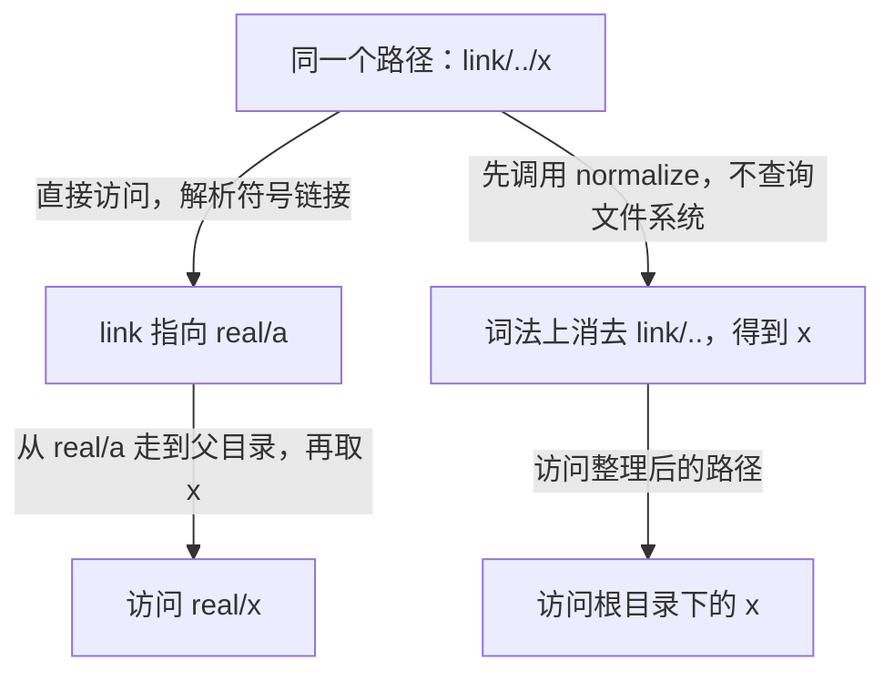

# File 路径模型：构造、解析与相等性

本文只讨论路径如何表达与解释。文件系统操作见[查询、创建、遍历与迁移](./operations.md)，完整运行示例见[FileLab](./lab.md)。

## File 究竟表示什么

`java.io.File` 表示一个**文件或目录的抽象路径名**。“抽象”表示 Java 用统一的对象接口描述不同系统的路径；`File` 本身是可以直接实例化的普通类，并非 Java 语法中的 `abstract class`。[官方定义](https://docs.oracle.com/en/java/javase/25/docs/api/java.base/java/io/File.html)

```java
File report = new File("reports", "daily.txt");
```

这行代码只表达“我想指向 `reports` 下名为 `daily.txt` 的位置”。它没有保证该位置存在，没有创建父目录，没有打开文件，也没有把文件内容装进内存。

可以把三层关系写成：

```text
File / Path         → 描述要访问的位置
文件系统中的对象     → 这个位置可能对应普通文件、目录、链接，也可能不存在
流 / Reader / Channel → 打开后用于传输内容，需要管理生命周期
```

因此：

- `.txt` 后缀不能证明路径对应普通文件；目录也可以叫 `daily.txt`。
- 同一个路径可以先不存在，随后成为文件，再被删除；已有的 `File` 对象仍保存原来的路径。
- `File` 不持有打开的文件句柄，没有 `close()`。需要关闭的是流等资源。
- `File` 对象的路径不可变；磁盘上的状态可以被当前程序、其他线程或其他进程改变。


## 先运行一个只有路径、没有写入的例子

保存为 `FileIntro.java`：

```java
import java.io.File;

public class FileIntro {
    public static void main(String[] args) {
        File file = new File("notes", "hello.txt");

        System.out.println("工作目录 = " + System.getProperty("user.dir"));
        System.out.println("保存的路径 = " + file.getPath());
        System.out.println("文件名 = " + file.getName());
        System.out.println("父路径 = " + file.getParent());
        System.out.println("绝对路径 = " + file.getAbsolutePath());
        System.out.println("此刻存在 = " + file.exists());
    }
}
```

```sh
javac -encoding UTF-8 FileIntro.java
java FileIntro
```

假设在 macOS 的 `/work/demo` 目录启动，且没有对应文件，则可看到：

```text
工作目录 = /work/demo
保存的路径 = notes/hello.txt
文件名 = hello.txt
父路径 = notes
绝对路径 = /work/demo/notes/hello.txt
此刻存在 = false
```

前五行展示路径的解释方式；最后一行才查询文件系统。`exists()` 可能输出 `true`，取决于运行时实际状态，这不意味着构造器创建了文件。

## 四种构造方式与跨平台路径

### 从字符串、父目录或 URI 构造

以下是独立的 API 用法片段，需在方法中执行并导入 `java.io.File`、`java.net.URI`：

```java
File a = new File("notes/hello.txt");
File b = new File("notes", "hello.txt");
File directory = new File("notes");
File c = new File(directory, "hello.txt");
File d = new File(URI.create("file:///tmp/hello.txt")); // Unix 路径示例
```

| 构造器 | 适用情形 |
| --- | --- |
| `File(String pathname)` | 已经拿到一段路径字符串 |
| `File(String parent, String child)` | 父路径与子路径分开提供 |
| `File(File parent, String child)` | 已有表示目录的对象，要定位子项 |
| `File(URI uri)` | 已有符合条件的本地 `file:` URI |

完整路径参数或 child 为 `null` 会抛 `NullPointerException`；两个带 parent 的重载允许 parent 为 `null`，此时按 child 单独构造。parent 为 `""` 或空抽象父路径时则使用平台相关的默认目录，与 `null` 不同。`new File("")` 还有单参数空路径的特殊规则；业务配置应主动拒绝空值，避免依赖这些隐式解释。

URI 构造器不接收普通的 `https:` 或 `jar:` 地址。需要生成文件 URL 时使用 `file.toURI().toURL()`；老的 `File.toURL()` 已弃用，它不能正确处理所有需要转义的字符。整个 `File` 类没有因此被弃用。

### 分隔符有两种，含义不同

| 常量 | 分隔的是什么 | macOS/Linux | Windows |
| --- | --- | --- | --- |
| `File.separator` / `separatorChar` | 一个路径里的各级名称 | `/` | `\` |
| `File.pathSeparator` / `pathSeparatorChar` | 路径列表中的多个路径 | `:` | `;` |

前者用于目录层级，后者用于类似 `PATH`、classpath 的路径列表。一般优先用父子构造器或 `Path.resolve`，减少自己拼接分隔符。

Windows Java 字符串中的反斜线还需要转义，例如 `"C:\\work\\notes.txt"`。Windows 的 `C:notes.txt` 是盘符相关的相对路径，不等于 `C:\notes.txt`。在 macOS 上构造包含 `C:` 的字符串，也不会让 Java 自动按 Windows 文件系统解释它。

### 绝对 child 是一个容易记反的边界

不要把 `new File(parent, child)` 直接理解为 `Path.resolve(child)` 的完全等价替换。当 `parent != null` 且 child 为绝对路径时，`File` 契约规定以平台相关方式把 child 转成相对形式再处理；而 `Path.resolve` 遇到绝对的 other 会返回 other。

本机 macOS 实验：

```java
new File("/base", "/tmp/x").getPath();  // /base/tmp/x
Path.of("/base").resolve("/tmp/x");    // /tmp/x，Java 11+
```

这里展示的是 Unix 实现的具体结果，不能硬套 Windows。实际业务应明确要求 child 为相对路径，且另行校验越界，不能靠构造器作为访问范围限制。[File 构造器契约](https://docs.oracle.com/en/java/javase/25/docs/api/java.base/java/io/File.html#%3Cinit%3E(java.lang.String,java.lang.String))、[OpenJDK Unix 路径解析实现](https://github.com/openjdk/jdk/blob/jdk-25-ga/src/java.base/unix/classes/java/io/UnixFileSystem.java)

## 相对路径、绝对路径和规范路径

### 相对路径以哪里为基准

```java
File file = new File("config/app.properties");
```

这里通常相对于 JVM 启动时的工作目录，能通过 `System.getProperty("user.dir")` 帮助诊断。它不必等于 Java 源文件所在目录、`.class` 所在目录或 JAR 所在目录。IDE、终端、测试工具和容器的启动目录可能不同，这正是“本地能读、部署后找不到”的常见原因。

`~` 和 `$HOME` 也不会因为写进 Java 字符串就得到 shell 展开。用户主目录可通过 `System.getProperty("user.home")` 获取，再拼接子路径。不要把运行中修改 `user.dir` 当作切换操作系统工作目录的方法；例如 OpenJDK 的 Unix 路径实现会缓存初始化得到的目录值。

项目中的可配置目录最好在启动时解析为明确的绝对路径，记录到日志，再传给业务代码。[OpenJDK UnixFileSystem](https://github.com/openjdk/jdk/blob/jdk-25-ga/src/java.base/unix/classes/java/io/UnixFileSystem.java)

### 几个名字相近的方法怎样选

| 方法 | 回答的问题 | 要点 |
| --- | --- | --- |
| `getPath()` | 这个对象保存的路径是什么 | 不保证与输入字符串逐字符相同；构造时可能整理分隔符 |
| `getName()` | 最末级名称是什么 | 不等于绝对路径；根路径可能没有名称 |
| `getParent()` / `getParentFile()` | 路径中写出的父级是什么 | 仅有 `a.txt` 时是 `null`，不是隐式工作目录 |
| `isAbsolute()` | 路径是不是绝对形式 | 不判断存在性 |
| `getAbsolutePath()` / `getAbsoluteFile()` | 补足基准目录后在哪里 | 通常保留 `.`、`..`，不保证解析符号链接 |
| `getCanonicalPath()` / `getCanonicalFile()` | 平台规范化后怎样表示 | 可查询文件系统、解析符号链接，可能抛 `IOException` |

例如工作目录为 `/work/demo`，中间目录存在且没有符号链接干扰时：

```java
File file = new File("notes/../hello.txt");
System.out.println(file.getPath());          // notes/../hello.txt
System.out.println(file.getAbsolutePath());  // /work/demo/notes/../hello.txt
System.out.println(file.getCanonicalPath()); // /work/demo/hello.txt
```

规范路径不等于“文件已经存在”。不存在的位置也可能得到 canonical path；之后创建或删除文件、改变链接，结果还可能变化。要解析一个**已经存在**的真实路径，可以使用 `file.toPath().toRealPath()`。

`Path.normalize()` 又是另一种操作：它只整理路径表达式，不访问文件系统。如果中间包含符号链接，简单消除 `link/..` 可能改变路径实际指向。`normalize()`、`getCanonicalPath()`、`toRealPath()` 因而不能无条件互换。[路径操作教程](https://docs.oracle.com/javase/tutorial/essential/io/pathOps.html)、[Path API](https://docs.oracle.com/en/java/javase/25/docs/api/java.base/java/nio/file/Path.html)

本机还验证了这个具体例子：临时根目录同时存在 `x`、`real/x` 与目录 `real/a`，链接 `link` 指向 `real/a`。访问 `link/../x` 读到的是 `real/x`；先执行 `normalize()`，路径变成根目录下的 `x`，读到的内容就不同了。差异来自操作系统解析符号链接与 Java 纯词法整理路径的顺序。

下图中所有相对路径都以这同一个临时根目录为基准，观察两条路线在哪一步分开：



图中两条路线都可能成功，却访问不同文件。因此 `normalize()` 适合整理路径表达式，不能证明“整理前后一定是同一个实际文件”；是否跟随链接、是否要求目标存在，需要结合具体操作的契约判断。[Path.normalize 契约](https://docs.oracle.com/en/java/javase/25/docs/api/java.base/java/nio/file/Path.html#normalize())

## 从源码理解 File 的边界

OpenJDK 25 的 `File` 用不可变的路径字符串保存抽象路径，并把大量操作交给平台的文件系统实现；例如 Unix 与 Windows 的具体解析规则不同。下面是职责示意，不是 JDK 源码逐字摘录：

```text
构造 File       → 整理和保存路径
getName         → 分析保存的路径
exists / length → 通过文件系统实现查询外部状态
create / delete → 通过文件系统实现修改外部状态
toPath          → 获得 NIO 路径对象，交给 Files 做进一步操作
```

这解释了几个现象：查询磁盘状态不是简单读取对象里缓存的业务字段；路径对象不变不代表操作无副作用；同一方法在不同平台会有不同能力和限制。`File` 本身不提供文件内容的读取缓冲、锁或事务。[OpenJDK File.java](https://github.com/openjdk/jdk/blob/jdk-25-ga/src/java.base/share/classes/java/io/File.java)

### equals、hashCode 与真实文件身份

`File` 实现 `Comparable<File>` 和 `Serializable`。比较与哈希基于抽象路径及平台比较规则，不读取文件内容；序列化的是路径相关信息，不是把该文件的所有字节打包进去。

```java
File a = new File("report.txt");
File b = new File("./report.txt");
System.out.println(a.equals(b)); // 本机实验为 false
```

不同路径可能通过 `.`、符号链接或硬链接指向同一个实际文件，路径比较却不相等。反过来，同一个 `File` 今天与明天保存相同路径，也不能证明磁盘对象没被替换。

若要检查两个已有路径是否定位同一文件，用 `Files.isSameFile(a.toPath(), b.toPath())`；它不是“内容相同”检查。另一个细节是：该 API 对两个相等的 Path 可以直接返回 `true`，不必先验证存在性，所以不要借此证明文件存在。

`compareTo` 也不是按大小或修改时间排序。需要按业务属性排序，应明确提供比较器，并考虑每次属性读取的 I/O 成本及失败处理。[Files.isSameFile](https://docs.oracle.com/en/java/javase/25/docs/api/java.base/java/nio/file/Files.html#isSameFile(java.nio.file.Path,java.nio.file.Path))

## 空路径与版本边界

JDK 25 修正了空路径 `new File("")` 的不一致行为，使相关操作按当前用户目录处理；旧版本一些查询可能返回 false 或 0。JDK 25 也统一了 Windows 上路径组件末尾空格导致的失败行为。因此空路径、特殊文件名和平台差异需要结合目标 JDK 验证。[JDK 25 发行说明](https://www.oracle.com/java/technologies/javase/25-relnote-issues.html)

NIO.2 的 `Path`、`Files` 自 Java 7 提供；`Path.of` 自 Java 11 提供，Java 7/8 可使用 `Paths.get`。早期文档中的 SecurityManager 与操作系统权限也要分开理解：JDK 24 起 SecurityManager 被永久禁用，但操作系统的文件权限仍然生效。[官方版本说明](https://docs.oracle.com/en/java/javase/24/security/security-manager-is-permanently-disabled.html)

## 路径模型的使用边界

路径构造或规范化不能自动建立安全访问范围。涉及上传和不可信路径时，继续阅读[工程实践](../practice.md)中的路径范围、符号链接与竞争问题。

classpath 资源也未必是磁盘文件：开发时可能在目录里，打包后可能在 JAR 中，不能把所有资源 URL 都转换为 `File`。读取打包资源应根据 API 的资源语义处理；参见[工程场景中的 JAR 资源](../practice.md#压缩序列化与-jar-资源)。

下一篇：[File 查询、创建、遍历与迁移](./operations.md)。
