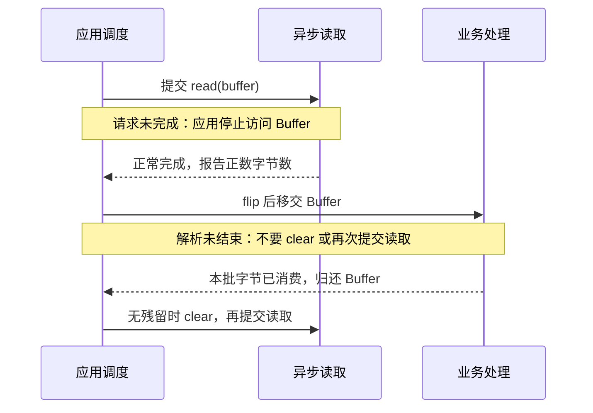

# 异步通道的完成模型与 Buffer 所有权

本文从单次异步操作建立模型：提交之后由谁接收结果，Buffer 什么时候归还，多个操作如何表达业务顺序。阅读前应了解 [Buffer 的位置状态](../basics/buffers.md)。

## 就绪通知与完成通知处理不同阶段

假设程序需要接收网络数据，可以分成三种交互方式：

| 使用方式 | 调用者做什么 | 得到的结果 |
| --- | --- | --- |
| 阻塞 `SocketChannel.read` | 调用并等待本次读取返回 | 本次实际读取的字节数 |
| 非阻塞 `SocketChannel` + `Selector` | 等待就绪通知，然后自己调用 `read` | 就绪事件不等于数据已经读进 Buffer |
| `AsynchronousSocketChannel.read` | 提交 Buffer 和读取请求，稍后接收完成结果 | 完成时已经知道本次读了多少字节，或为什么失败 |

**非阻塞描述一次调用怎样等待；异步描述提交操作与接收结果怎样分离。** 在 Java 的 Selector 模型里，程序仍在就绪后执行读写；异步通道则让程序消费操作的完成通知。[java.nio.channels 的 I/O 模型](https://docs.oracle.com/en/java/javase/25/docs/api/java.base/java/nio/channels/package-summary.html)

可以用两句伪代码对照：

```text
Selector：通知“可能可读” → 应用调用 read(buffer) → 检查读取结果
异步通道：应用提交 read(buffer, handler) → 收到 completed(n) 或 failed(error)
```

这里的“完成”指**本次 I/O 请求**完成。它不保证一个文件读完、一条业务消息收齐，也不保证对端已经处理请求。

不要仅凭类名推断内核实现。OpenJDK 25 的 `SimpleAsynchronousFileChannelImpl` 会向 executor 提交任务，在任务中执行文件读写；这是异步 API 可以由后台工作线程实现的具体例子。不能据此推断所有平台、Provider 或异步 Socket 都用相同机制，更不能断言 Java 异步文件 I/O 必然使用 `io_uring`。[OpenJDK 25 实现](https://github.com/openjdk/jdk/blob/jdk-25-ga/src/java.base/share/classes/sun/nio/ch/SimpleAsynchronousFileChannelImpl.java)

## 接收结果有 Future 和 CompletionHandler 两种方式

### Future 表示结果尚未就绪，不代表调用者永不等待

以下是 Java 11+ 的方法体片段，假设 `channel` 是以读取权限打开的 `AsynchronousFileChannel`。需要导入 `java.nio.ByteBuffer` 和 `java.util.concurrent.Future`；外层方法需处理 `get()` 的 `InterruptedException` 与 `ExecutionException`。完整导入、打开和关闭方式见[异步文件实验](./lab.md)。

```java
ByteBuffer buffer = ByteBuffer.allocate(4096);
Future<Integer> pending = channel.read(buffer, 0L);
// 此处可以做与 buffer 无关的其他工作。
int count = pending.get(); // 如果尚未完成，这个调用仍会等待。
```

`read` 提交读取，`get` 等待结果。把两者紧贴在循环里，就很容易把应用写回“一次提交、一次等待”的串行流程。API 仍是异步的，但程序没有利用提交与完成之间的时间去组织其他工作。[Future.get](https://docs.oracle.com/en/java/javase/25/docs/api/java.base/java/util/concurrent/Future.html#get())

异步方法声明返回 `Future<Integer>`，不能把它强转成 `CompletableFuture<Integer>`。前者提供等待、检查和取消等接口；后者还支持 `thenApply`、`thenCompose` 等结果组合，并允许显式完成。实现没有义务返回后者。

也不要为了“变成 CompletableFuture”便给每次操作加一层 `supplyAsync(() -> pending.get())`：这会额外安排一个等待任务。更直接的桥接方式是在完成处理器中完成你自己创建的 `CompletableFuture`。[AsynchronousChannel 两种调用形式](https://docs.oracle.com/en/java/javase/25/docs/api/java.base/java/nio/channels/AsynchronousChannel.html)、[CompletableFuture](https://docs.oracle.com/en/java/javase/25/docs/api/java.base/java/util/concurrent/CompletableFuture.html)

### CompletionHandler 的两个类型参数分别表示什么

`CompletionHandler<V, A>` 中，`V` 是操作结果，`A` 是随操作携带的上下文。读取常用 `Integer` 表示字节数；attachment 可以保存连接状态、请求编号或此次操作的结果容器。

```java
// 接口形状，帮助理解；不是完整程序。
void completed(V result, A attachment);  // 操作成功完成
void failed(Throwable error, A attachment); // 操作失败
```

attachment 不是 Java 自动帮你隔离的副本。如果多个操作共享同一个可变上下文，仍然需要明确并发规则。两个方法都应尽快返回，让执行它们的线程继续分发其他完成通知。[CompletionHandler 契约](https://docs.oracle.com/en/java/javase/25/docs/api/java.base/java/nio/channels/CompletionHandler.html)

不要在回调里等待另一个由相同线程池完成的操作。假设池里只有两个线程，而两个回调都在 `get()` 中等待新请求：新请求可能正等待这两个线程处理，形成线程池饥饿甚至死锁。

实际业务中的数据库查询、慢日志、复杂压缩和长时间计算，应交给有容量控制的业务执行器。完成回调只做短小的状态推进、结果转交或下一次 I/O 提交。

## 异步文件通道没有共享文件 position

`AsynchronousFileChannel.read(buffer, offset)` 的 `offset` 是**文件偏移量**，不是 Buffer 的 position。文件通道没有“当前读到哪里”的共享游标，每次调用都必须明确指定位置；Buffer 自己仍然有 position、limit、capacity。[AsynchronousFileChannel 定位规则](https://docs.oracle.com/en/java/javase/25/docs/api/java.base/java/nio/channels/AsynchronousFileChannel.html)

例如，文件偏移量为 4096，Buffer 的 position 为 10，实际读了 100 字节：文件内容从第 4096 字节开始，写入 Buffer 的索引 10 到 109；完成后 Buffer 的 position 变成 110。若想继续同一段文件，下一次文件偏移量应当加 **100**，不能直接加 Buffer 的容量。

### 单次完成不等于整块完成

读取最多填充 Buffer 的 remaining，写入最多消费 Buffer 的 remaining。它们可能部分完成。读取还要区分正数字节数、零字节结果和 `-1` 的 EOF。[AsynchronousByteChannel 读写契约](https://docs.oracle.com/en/java/javase/25/docs/api/java.base/java/nio/channels/AsynchronousByteChannel.html)

需要读取一个完整逻辑块时，设计的是多次操作组成的任务：

```text
任务状态 = 文件偏移量 + 剩余目标长度 + 当前缓冲区 + 终止状态
提交一次 read
完成 n > 0：偏移量 += n；剩余目标长度 -= n
尚未满足目标且未 EOF：再提交下一次 read
完成 -1：根据业务判断“允许短文件”或“文件被提前截断”
失败：让整个任务异常结束并释放拥有的资源
```

零进展不能当作 EOF，也不应无限同步递归重试。需要检查是否提交了没有 remaining 的 Buffer，并定义让出执行权、重试限额或终止策略。若读取会跨文本编码边界，还需要增量 `CharsetDecoder` 和残留字节，不能逐块随意 `new String(...)`。

### 多个操作可以并发，业务依赖必须自己表达

异步文件通道允许多个读取和写入处于未完成状态，不保证操作执行次序或处理器调用次序。多个不重叠块可以使用独立 Buffer 并行读取，最后按块编号组装；若 B 依赖 A 的写入结果，就在 A 完成后再提交 B。[并发与顺序约束](https://docs.oracle.com/en/java/javase/25/docs/api/java.base/java/nio/channels/AsynchronousFileChannel.html)

设 A 向 `[0, 4096)` 写入，B 向 `[2048, 6144)` 写入，二者在 `[2048, 4096)` 重叠。通道的线程安全不等于给应用定义“谁覆盖谁”，也不等于两次写入构成事务。应在应用层串行化冲突操作，或按互不重叠的区间分配所有权。

同样，先提交 write 再提交 read，不能据此声称后者一定看到新数据。顺序依赖应由完成链明确表达；需要持久化保证时，还要单独考虑 `force`、文件系统以及业务恢复协议。

不要把 `size()`、`truncate()`、`force()` 也当作返回 future 的方法。异步文件通道同时提供同步方法；类名不会替所有操作作出非阻塞保证。

## Buffer 的所有权比回调写法更重要

发起读写后，到该操作完成前，应用应当停止访问参与操作的 Buffer。`clear()`、`flip()`、改变 position、复用内容或交给另一次 I/O 都可能破坏正在进行的操作。[Buffer 并发约束](https://docs.oracle.com/en/java/javase/25/docs/api/java.base/java/nio/channels/AsynchronousByteChannel.html)

建议把 Buffer 的生命周期理解成一次借用。下面展示把结果交给业务任务解析时的正常路径；三列代表职责，不要求分别对应三个独立线程。



重点有两个归还时刻：I/O 完成后才能解析，业务处理结束后才能复用同一存储区。完成通知本身不替应用建立业务线程之间的协调；移交和归还还需通过线程安全队列、完成结果或其他同步机制表达。

图中假定本批字节已经全部消费；若还留有半条消息或半个编码字符，就应保留残留数据，而非直接 `clear()`。零进展、EOF 和失败则按前文的任务状态处理，不能无条件进入下一次读取。

这个流程描述正常完成路径。取消和 Socket I/O 超时可能让 Buffer 处于不确定状态，不能看到 future 进入终态，就一律认定内存可安全复用；具体边界见[取消、等待超时与操作超时](./concurrency.md#取消和超时都不表示撤销已经发生的-io)。

一个常见错误是循环里重复使用同一 Buffer，不等前一次读取完成就 `clear()` 并再次提交。对象引用虽然没变，它的游标和存储区却被两个操作同时使用。

`duplicate()` 和 `slice()` 也不能自动解决所有权问题：它们可以有独立游标，但仍共享底层字节。两个视图如果操作重叠区域，依然可能产生数据竞争。需要独立内存、明确划分不重叠区域，或者等待前一个操作结束。

另一种错误发生在回调之后：把 Buffer 交给业务线程解析，同时立刻在 I/O 线程上 `clear()` 并提交下次读。解决方式是让解析完毕再归还 Buffer，或把数据复制到另一个由业务任务独占的载体。

复制有成本，零复制也有所有权和容量成本。正确性先于减少一次拷贝；测量后再选择缓冲区池、分片或引用计数。

## 异步 Socket 仍需要协议状态机

`AsynchronousSocketChannel` 支持同时进行一项读和一项写，但同一时刻最多只能有一个未完成的读、一个未完成的写。前一项尚未完成时，再发起同方向操作会直接抛 `ReadPendingException` 或 `WritePendingException`，并不会自动排队。[Socket 并发规则](https://docs.oracle.com/en/java/javase/25/docs/api/java.base/java/nio/channels/AsynchronousSocketChannel.html)

因此，让十个业务线程直接调用同一个 channel 的 `write` 不是安全的消息发送队列。一般要为每条连接维护一个出站队列，只有队首可以占用写槽；写完后才处理下一项。

下面是**设计伪代码，不能直接编译**。为便于学习，它采用串行的请求—响应模型；所有状态变化进入同一个连接调度器，读写使用不同 Buffer：

```text
READING：提交唯一的一次 read(input)
  completed(n > 0)：
    input.flip()
    增量解析协议，保留尚未组成完整消息的字节
    input.compact()
    若消息未完整：检查容量/最大消息长度，再提交 read
    若消息已完整：进入 PROCESSING，暂不继续读取
  completed(-1)：按协议处理输入结束和残留半包
  failed(error)：进入 CLOSED，统一失败处理

PROCESSING：将消息转交业务执行器
  完成后回到连接调度器：把响应放入有界出站队列
  准备队首 output 的 position/limit；先进入 WRITING，再提交唯一的 write

WRITING：
  completed(n)：
    若 output.hasRemaining()：继续提交剩余字节的 write
    否则释放队首；还有响应就写下一项
    队列排空后，先处理 input 中已缓存的下一条完整消息
    没有完整消息且输入未结束时，回到 READING 继续接收
  failed(error)：进入 CLOSED，失败剩余发送任务

CLOSED：只执行一次关闭/释放；拒绝后续业务结果再次提交 I/O
```

这个状态机需要补齐提交方法直接抛异常的路径，并对零进展设置让出或终止策略。连接关闭后，业务执行器可能仍返回结果，调度器必须检查 CLOSED，不能重新启动已经结束的连接。

真实 TCP 协议还要决定分帧方式：固定长度、长度字段、分隔符或其他协议结构。一次 `read` 可能只有半条消息，也可能包含多条消息；一次 `write` 完成也只表示传输了相应字节，不代表远端业务确认。

如果想提升流水线吞吐，可以同时维持一项读和一项写，但仍需保护解析状态、缓冲区以及出站队列。伪代码选择读完请求再写响应，是为了让状态转换更容易验证。

## 继续学习

运行[异步文件读取实验](./lab.md)，观察完成结果如何跨线程传递，以及何时才能重新读取 Buffer。线程池、配额和超时策略集中在[并发控制与生命周期](./concurrency.md)；用[异步通道面试题](../interview/async.md)检查理解。
