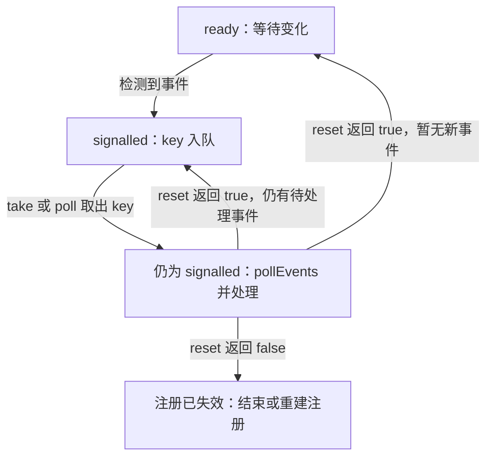

# WatchService：WatchKey、事件溢出与重新扫描

本文解决“监听事件代表什么，以及怎样恢复下一次通知”。它包含独立可运行的 Java 11+ 监听器；[路径模型](./paths.md)与[目录遍历](./operations.md)用于理解注册对象和重新扫描。

## WatchService 通知你重新检查目录

### 先理解 WatchKey 的生命周期

注册目录得到 `WatchKey`，事件到来后该 key 变为 signalled 并排队；消费者取出 key、处理 `pollEvents()`，随后调用 `reset()`。在 signalled 状态下，新事件仍可积累，但 key 不会因为每条新事件都再次入队。

`reset()` 的返回值代表注册是否仍有效；false 时应移除该注册。漏掉 reset 常表现为“第一次能收到，后面不再收到”。[WatchKey API](https://docs.oracle.com/en/java/javase/25/docs/api/java.base/java/nio/file/WatchKey.html)

`pollEvents()` 取走当前积累的事件；`reset()` 恢复后续通知能力。如果处理期间又积累了事件，reset 会让 key 立即重新入队。多消费者场景应在当前事件处理完成之后再 reset，避免多个线程同时处理同一注册。

下面把“key 的状态”和“key 是否正在队列里”放在同一张流程图中。重点观察：`take()` 取出 key 后，它仍是 signalled；只有正确处理 `reset()` 的结果，才完成这一轮消费。



图中失效分支表示消费者在 `reset()` 时发现结果，不表示注册只能在这个时刻失效；主动取消、对象无法访问或关闭 WatchService 都可能使 key 失效。已经排队的 key 被取消后仍可能取出，因此不能把“从队列拿到 key”等同于“注册仍有效”。[WatchKey 的取消与重置契约](https://docs.oracle.com/en/java/javase/25/docs/api/java.base/java/nio/file/WatchKey.html)

### 运行一个会在溢出时重新扫描的监听器

保存为 `WatchDirectory.java`。它监听传入目录的直接子项；处理 `OVERFLOW` 时列出当前目录状态，不尝试凭丢失事件还原完整历史。

```java
import java.io.IOException;
import java.nio.file.*;
import java.util.stream.Stream;

import static java.nio.file.StandardWatchEventKinds.*;

public class WatchDirectory {
    private static void scan(Path dir) throws IOException {
        try (Stream<Path> entries = Files.list(dir)) {
            System.out.println("当前目录：");
            entries.map(Path::getFileName).sorted().forEach(System.out::println);
        }
    }

    public static void main(String[] args) throws IOException, InterruptedException {
        if (args.length != 1) {
            throw new IllegalArgumentException("用法: java WatchDirectory <目录>");
        }
        Path dir = Path.of(args[0]).toAbsolutePath();
        try (WatchService watcher = dir.getFileSystem().newWatchService()) {
            dir.register(watcher, ENTRY_CREATE, ENTRY_DELETE, ENTRY_MODIFY);
            scan(dir);
            for (;;) {
                WatchKey key = watcher.take();
                for (WatchEvent<?> event : key.pollEvents()) {
                    if (event.kind() == OVERFLOW) {
                        System.out.println("事件溢出，重新扫描");
                        scan(dir);
                    } else {
                        Path name = (Path) event.context();
                        System.out.println(event.kind().name() + " " + dir.resolve(name));
                    }
                }
                if (!key.reset()) {
                    System.out.println("目录注册失效，结束监听");
                    break;
                }
            }
        }
    }
}
```

```sh
javac -encoding UTF-8 WatchDirectory.java
mkdir watch-demo
java WatchDirectory watch-demo
```

在另一个终端或文件管理器里创建、修改、删除 `watch-demo` 下的文件，观察输出；按 Ctrl+C 结束这个长期运行的示例。目录监听的标准流程与事件上下文解释可参考 [Oracle 监听教程](https://docs.oracle.com/javase/tutorial/essential/io/notification.html)。

观察时用“操作后当前状态是否一致”检验结果，不把通知条数与手工操作次数一一对应。普通创建、修改操作未必触发 `OVERFLOW`，这个分支用于处理事件丢失，不能因为一次实验没进入就认为它多余。目录树递归、重试和服务停机需要独立策略，见下面的边界说明。

### 不要依赖逐次、即时、恰好一次的通知

WatchService 的事件可能合并、重复或溢出；修改事件也不代表写入者已关闭文件。实现可能使用本地通知，也可能轮询；网络文件系统上的远程变化不保证可检测。[WatchService API](https://docs.oracle.com/en/java/javase/25/docs/api/java.base/java/nio/file/WatchService.html)

因此，监听器应把事件当作“缓存可能需要刷新”的提示，实际内容以重新读取的状态为准。需要消费完整文件时，可让写入方写临时文件后发布，或约定独立的完成标记；简单等待一个固定时长不能证明写入已经完成。

标准目录注册只关注该目录直接子项。递归监听需要为已有子目录分别注册，并在新子目录出现时添加注册；“扫描目录”和“注册新目录”之间仍可能发生变化，所以可靠同步工具还需要重扫与校准机制，而不是仅增加递归调用。

示例遇到无法扫描目录等 I/O 异常时会退出，并由 `try-with-resources` 关闭 watcher；它不是后台服务的完整恢复策略。服务中还需要定义错误重试、注册重建与停机行为。

## 从监听回到状态校准

业务应维护需要的当前状态，并在事件提示、溢出或注册变化后重新核实。面试中围绕 WatchKey、`reset()`、`OVERFLOW` 和写入完成分别解释，练习见[文件系统问答](../interview/files.md)。
