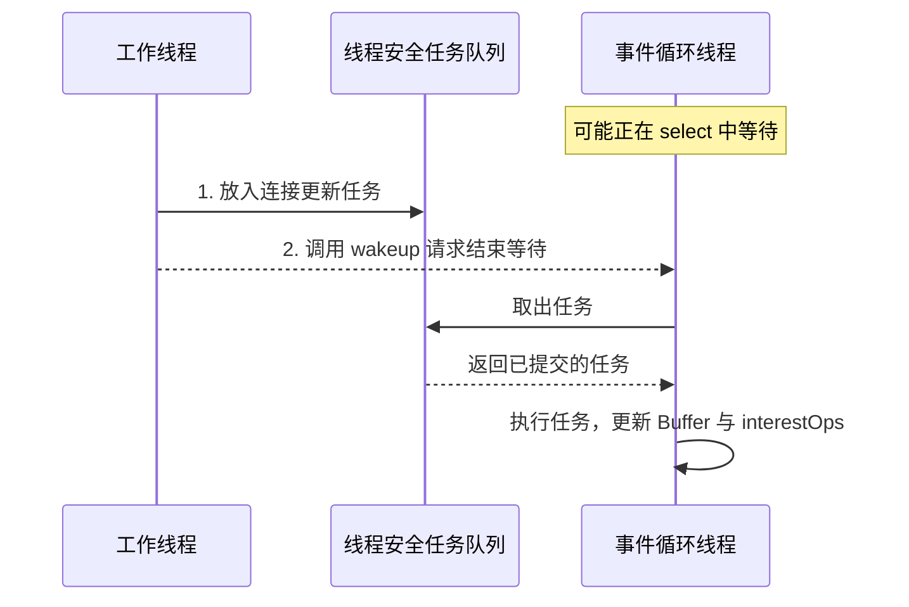

# 事件循环的工程边界：分帧、背压与 Reactor

[回声服务器](./server.md)让一个线程独占连接状态，只处理字节回声。本文沿这个模型说明真实应用还需要补齐哪些机制；逻辑片段保留关键操作，但不构成独立完整程序。

## 非阻塞连接也有状态机

[验证客户端](./client.md)为了验证数据，采用阻塞 Socket。若要把客户端也纳入 selector，需要处理连接建立阶段。下面是逻辑片段，不是独立完整程序：

```java
SocketChannel channel = SocketChannel.open();
channel.configureBlocking(false);
boolean connected = channel.connect(remoteAddress);
channel.register(selector, connected
        ? SelectionKey.OP_READ : SelectionKey.OP_CONNECT);

// 在事件循环中：
if (key.isConnectable()) {
    SocketChannel client = (SocketChannel) key.channel();
    if (client.finishConnect()) {
        key.interestOps(SelectionKey.OP_READ);
    }
}
```

`connect()` 返回 true 表示立即建立连接，返回 false 表示仍在进行；`finishConnect()` 返回 true 才表示连接完成，非阻塞模式下它仍可能返回 false。连接失败通常通过异常报告，`OP_CONNECT` 本身不代表连接成功。[SocketChannel.connect 与 finishConnect](https://docs.oracle.com/en/java/javase/25/docs/api/java.base/java/nio/channels/SocketChannel.html#finishConnect())

实际客户端还要在连接成功后调度待发送数据，并实现连接超时。构造远端地址可能涉及名称解析，也不能把这类可能耗时的工作无条件放进事件循环。

## 跨线程协作：队列保存工作，wakeup 唤醒等待

教学程序让一个线程独占连接状态，因此没有 buffer 的并发竞争。加入业务工作线程后，最好继续保留这个约束：工作线程计算结果，把变更任务放入线程安全队列，再调用 `selector.wakeup()`；事件循环取出任务，更新输出 buffer 或兴趣集合。

```java
// 工作线程：先入队，再唤醒。
tasks.add(() -> enqueueResponseOnEventLoop(key, response));
selector.wakeup();

// 事件循环的逻辑片段：
while (running) {
    drainTasks();
    selector.select();
    drainTasks();
    processSelectedKeys();
}
```

上述辅助函数是架构伪代码，未包含在回声服务器里。`wakeup()` 不是任务队列，多次调用可以合并；实际工作与内存可见性要靠线程安全队列保证。先入队再唤醒，也避免事件循环被叫醒后发现没有工作，又睡回去。



观察图中的两条交接路径：任务队列保存要执行的工作，`wakeup()` 只负责推动等待结束。连接状态仍由事件循环线程修改。这是本节采用的所有权约定，不是说 Java API 禁止所有跨线程调用；如果唤醒时没有正在进行的选择，唤醒效果也可能由下一次选择消费，具体语义见下方官方文档。

Selector 与 SelectionKey 的并发使用支持，不意味着 selected-key 集合、attachment 中的业务对象或 ByteBuffer 自动安全。正在进行的 selection 不受本轮中途修改兴趣集合影响；单线程管理连接状态可以减少这类时序问题。[Selector 并发语义与 wakeup](https://docs.oracle.com/en/java/javase/25/docs/api/java.base/java/nio/channels/Selector.html#wakeup())

`key.isValid()` 也不是一把锁：若允许别的线程取消 key，检查之后它仍可能失效。本例由事件循环管理 channel 和 key 生命周期；扩展为跨线程直接取消、关闭时，还要处理 `CancelledKeyException` 等竞争结果，不能只补一个 if 就认为线程安全。

不要让事件循环等待数据库查询、同步 HTTP 调用或耗时计算。否则一个连接的业务工作就会延迟同一循环中的其他连接。工作线程池和回传队列也必须有容量限制，否则只是把积压位置换了地方。

## 真实协议必须解决分帧和字符解码

TCP 是有序字节流，不保留应用每次 write 的边界。发送两次 `hello` 和 `world`，接收端可能分成多次 read，也可能一次读到 `helloworld`；这不是 TCP 把消息“弄坏了”。[RFC 9293 的 TCP 字节流定义](https://www.rfc-editor.org/rfc/rfc9293.html#section-2.2)

本例只按字节回声，不需要知道消息边界。业务协议通常选择以下方案之一：

| 分帧方式 | 接收方如何判断完整报文 | 需要补充的限制 |
| --- | --- | --- |
| 固定长度 | 累计到约定字节数 | 处理提前 EOF |
| 分隔符 | 找到换行等边界 | 转义规则和最大行长 |
| 长度前缀 | 先读长度，再累计消息体 | 验证长度非负且不超过上限 |

例如四字节长度前缀不能假设一次 read 就读满。解析器要保存“头部已经收到几个字节、消息体还差多少”的状态；读取完整消息后，buffer 中还可能已经有下一条消息的一部分。

若继续使用固定 8 KiB 的完整帧缓存，却允许 100 KiB 报文，就会出现“缓存满了暂停读、报文不完整不能处理”的僵局。解决办法是限制报文、在允许范围内扩容，或者采用流式消费；回声例子的 buffer 设计不能不加调整地照搬到任意协议。

同样，不要对每次 read 得到的字节独立调用 `new String(...)` 来解析文本：一个 UTF-8 字符可能横跨两个读取结果。应先按字节完成分帧后统一解码，或使用能够保留未完成输入的 `CharsetDecoder`。相关 buffer 与解码基础见 [Buffer 状态与字符解码](../basics/buffers.md)。

## 背压与公平性需要贯穿整条处理链

[服务器实验](./server.md)在单连接缓冲区填满时暂停 OP_READ，写出数据后恢复。工程中还要限制连接总数、业务队列长度和最大报文长度；仅暂停网络读取，无法约束仍在生产响应的业务任务。

常见的高低水位策略是在队列超过上限时暂停读取，下降到较低阈值后恢复，减少频繁切换。每一个暂停状态都需要明确恢复条件，以及超时或放弃策略。

若为了吞吐把“每轮一次读写”改成循环，必须同时规定停止条件：返回 `0`、EOF、buffer 或队列边界、连接关闭，以及处理字节数或时间预算。否则既可能空转，也可能让一个一直有数据的连接饿死其他连接。

## 操作系统实现与现代 Java 的选择

OpenJDK 25 的 Linux 默认 provider 使用 `EPollSelectorProvider`，macOS 默认 provider 使用 `KQueueSelectorProvider`。这是指定版本和平台的实现事实，Java API 并不保证所有 JVM、所有平台都使用 epoll，也不承诺固定的复杂度或性能收益。[Linux 实现](https://github.com/openjdk/jdk/blob/jdk-25-ga/src/java.base/linux/classes/sun/nio/ch/DefaultSelectorProvider.java)、[macOS 实现](https://github.com/openjdk/jdk/blob/jdk-25-ga/src/java.base/macosx/classes/sun/nio/ch/DefaultSelectorProvider.java)

Java 21 正式提供虚拟线程。对大量等待网络 I/O 的业务，可以使用“一任务一虚拟线程”的同步代码，让运行时在等待时释放承载它的平台线程。这减少了应用手写 selector 状态机的必要性，但不消除连接限制、背压、协议解析和超时问题，也不会使 CPU 密集计算自动变快。[JEP 444](https://openjdk.org/jeps/444)、[Java 25 虚拟线程指南](https://docs.oracle.com/en/java/javase/25/core/virtual-threads.html)

注意版本边界：Java 21 的资料会提醒 `synchronized` 内阻塞导致 pinning；JDK 24 的 JEP 491 改善了这种情况。讲解 Java 25 时不能原样重复旧结论；native 方法或 foreign function 相关场景仍需注意。[JDK 24 变化说明](https://docs.oracle.com/en/java/javase/24/migrate/significant-changes-jdk-24.html)、[Java 25 的 pinning 说明](https://docs.oracle.com/en/java/javase/25/core/virtual-threads.html)

实践上，协议框架、需要精细控制连接状态和流量的基础设施仍可能采用事件循环；一般业务系统可以结合框架支持评估虚拟线程。选择应通过真实负载测试，而不是认定“NIO 一定比阻塞 I/O 快”。

### select、poll、epoll 的差别不能只背复杂度

Java 的 `Selector.select()` 是抽象接口，名字不代表它调用 Linux 的 `select`。下面比较 Linux 接口中的文件描述符（fd）管理：

| 接口 | 如何表达关注对象 | 返回后如何找就绪对象 |
| --- | --- | --- |
| `select` | 每轮传入 fd 集合，返回会改写集合 | 检查集合中的就绪位 |
| `poll` | 每轮传入 `pollfd` 数组 | 检查各项 `revents` |
| `epoll` | 通过 `epoll_ctl` 维护内核中的兴趣集合 | `epoll_wait` 返回就绪项 |

Linux/glibc 常见的 `FD_SETSIZE=1024` 是 `select` 的 fd 集合限制，不能说成“Java 最多支持 1024 个连接”；poll/epoll 没有这项固定限制，但仍受进程资源约束。[select 手册](https://man7.org/linux/man-pages/man2/select.2.html)、[poll 手册](https://man7.org/linux/man-pages/man2/poll.2.html)

epoll 的持久注册和就绪集合减少了重复提交、扫描大量非活跃 fd 的成本；注册变更、事件交付和处理仍有开销，因此不能概括成“所有操作都是 O(1)，连接再多也不变慢”。LT 在条件仍满足时可继续通知；ET 强调变化通知，使用非阻塞 fd 时，通常应推进到 `EAGAIN` 再等待新事件，避免遗漏仍待处理的数据。[epoll 手册](https://man7.org/linux/man-pages/man7/epoll.7.html)

LT/ET 属于底层通知语义，Java Selector API 没有通用切换开关。OpenJDK 25 的 Linux 实现能看到兴趣更新和事件处理，但不能把它推广成所有 provider 的承诺。[固定版本源码](https://github.com/openjdk/jdk/blob/jdk-25-ga/src/java.base/linux/classes/sun/nio/ch/EPollSelectorImpl.java)

### 三种 Reactor 划分分别解决什么瓶颈

Reactor 根据就绪事件分派处理器。下面是常见职责划分，不是 JVM 强制规定的线程模型；区别在于把业务计算或网络 I/O 分配给谁。[Doug Lea 的 Scalable IO in Java，第 19–26 页](https://gee.cs.oswego.edu/dl/cpjslides/nio.pdf)

| 模型 | 职责分配 | 主要代价或瓶颈 |
| --- | --- | --- |
| 单 Reactor 单线程 | 同一线程接受连接、读写、执行业务 | 简单；耗时业务拖住全部连接 |
| 单 Reactor + 工作池 | Reactor 接受连接与读写，工作池计算业务，结果交回 | 业务可并行；I/O 仍集中，交接队列需限流 |
| 主从 Reactor | 主 Reactor 接受并分配连接；多个子 Reactor 各有 selector 和事件循环；业务可再交工作池 | 分散 I/O；增加连接分配、负载均衡和协调成本 |

子 Reactor 不是“每连接一个线程”。通常让连接固定归属一个事件循环，保持 buffer 和输出顺序的管理边界；跨线程结果通过前文的队列与 `wakeup()` 交回。增加线程不能替代背压，也不自动提升吞吐。

## 沿状态排查故障

**CPU 空转要从“哪一层没有等待”开始排查。** 如果循环停留在应用内部，检查 `while (buffer.hasRemaining()) channel.write(buffer)` 遇到 0 后是否仍继续；如果反复从 selector 返回，检查永久 `OP_WRITE`、未处理 EOF、频繁 `wakeup()`、无限调用 `selectNow()` 和中断退出逻辑。不能一看到高 CPU 就归因于某个旧版本的 epoll 缺陷。

| 现象 | 优先检查 |
| --- | --- |
| CPU 高，但没有业务数据 | 是否永久开启 OP_WRITE，是否反复读取 EOF |
| 响应被截断 | 是否忽略部分 write，是否过早 clear 或 close |
| 有连接拖慢全部连接 | 事件循环是否执行阻塞或耗时任务 |
| 内存随慢客户端持续上涨 | 输出队列是否无上限，是否存在背压 |
| 多线程下出现随机错乱 | 谁拥有 buffer，是否并发修改连接状态 |
| 数据大小略大于某阈值就卡住 | 协议帧上限是否与缓冲区和暂停读取策略矛盾 |

复习时进入 [网络与 Selector 题库](../interview/network.md)和[场景题](../interview/scenarios.md)；下一步比较 [NIO.2 异步通道](../async-channels/)的完成通知、并发和生命周期。
