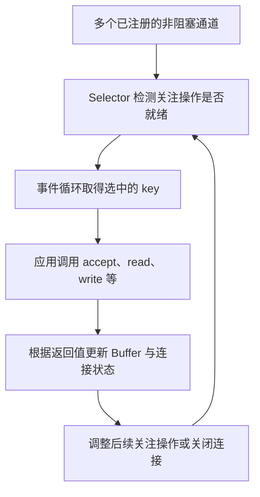

# Selector 与 SelectionKey：就绪、返回值与注册关系

本文解释 Selector 通知与实际传输之间的关系。先掌握这些契约，再运行 [有界回声服务器](./server.md)；缓冲区基础见 [Buffer 状态](../basics/buffers.md)。

## Selector 等待的是就绪，不是完整请求

设想有一万个连接，大部分时间都没有数据。若为每个连接占住一个平台线程等待，线程资源就会成为成本。Selector 允许一个事件循环集中等待多个连接的状态变化；某个连接就绪之后，由应用调用 `read()` 或 `write()` 推进传输。



图中的关键是从“就绪”到“实际读写”仍有一步应用调用。回到下一轮等待前，还要保存未完成数据并调整关注操作；就绪通知不会替应用把请求处理完。

`select()` 本身可以阻塞。它让事件循环在没有事情时休息，避免不停遍历所有连接调用 `read()`。每个网络通道设置成非阻塞，是为了事件循环处理其中一个连接时，不因等待该连接的数据而停住。

这是**就绪通知模型**：通知到达时，应用仍要执行 I/O 并检查结果。它不同于 [NIO.2 异步通道](../async-channels/) 的完成通知，也不会自动产生完整业务请求。[Selector 官方契约](https://docs.oracle.com/en/java/javase/25/docs/api/java.base/java/nio/channels/Selector.html)

### 注册关系由 SelectionKey 表示

可以把注册动作读成：“请这个 selector 关注这个 channel 的这些操作，并记住它的连接状态”。

下面是注册片段：`channel` 是已打开的可选择通道，`selector` 已创建，`state` 是应用自定义的连接状态对象。

```java
channel.configureBlocking(false);
SelectionKey key = channel.register(selector, SelectionKey.OP_READ, state);
```

`SelectionKey` 区分关注操作、就绪操作和附加的连接状态：

| 信息 | 谁决定 | 含义 |
| --- | --- | --- |
| `interestOps` | 应用 | 下一次选择时，希望关注哪些操作 |
| `readyOps` | Selector | 最近被检测到哪些操作就绪 |
| `attachment` | 应用 | 与这个注册关系绑定的连接状态 |

常见事件的含义如下：

| 操作位 | 适用场景 | 接到通知后做什么 |
| --- | --- | --- |
| `OP_ACCEPT` | 监听中的 `ServerSocketChannel` | 尝试接受新连接 |
| `OP_CONNECT` | 正在建立连接的 `SocketChannel` | 调用 `finishConnect()` |
| `OP_READ` | 接收字节 | 调用 `read()`，可能读到数据、EOF 或异常 |
| `OP_WRITE` | 发送字节 | 调用 `write()`，仍要处理部分写入或异常 |

就绪信息是提示，可能随外部状态变化而失效；`OP_READ` 也可能表示到达流末尾，不能把它解释为“一条消息已经到齐”。不同 channel 支持的操作位由 `validOps()` 决定。[SelectionKey 官方契约](https://docs.oracle.com/en/java/javase/25/docs/api/java.base/java/nio/channels/SelectionKey.html)

面试回答“就绪就一定读写成功吗”时，要区分三层：`isReadable()` 只检查 ready 位；`read()` 返回实际传输结果或异常；业务解析器再判断是否凑齐完整报文。三层中的后一层，都不能由前一层替代。类似地，`OP_CONNECT` 可能对应连接失败，`OP_WRITE` 也可能对应待报告的错误。

同一事件循环串行处理各连接；“一个线程照看多个连接”表示交替推进许多未完成连接，并不表示这个线程同时执行多个 `read()`。

## 读写返回值与未完成传输

对非阻塞 `SocketChannel` 调用 `read(dst)` 时：

| 返回值 | 含义 | 典型处理 |
| --- | --- | --- |
| `n > 0` | 本次得到 n 个字节 | 保留并处理这些字节 |
| `0` | 本次没有传入字节；也要检查 dst 是否已经没有剩余空间 | 等下一次机会或先腾出空间，不能当成断开 |
| `-1` | 输入方向到达流末尾 | 停止继续读取，按协议处理待发送数据 |

读到 n 个字节后，buffer 的 `position` 增加 n，`limit` 不变。一次读取没有填满 buffer，并不意味着请求结束。[ReadableByteChannel 官方契约](https://docs.oracle.com/en/java/javase/25/docs/api/java.base/java/nio/channels/ReadableByteChannel.html)

`write(src)` 返回本次写入的字节数，可能为 `0`，也可能小于 `src.remaining()` 的初始值。buffer 的 `position` 会自动越过已经写入的部分，所以不要自行再加一次 n。写入成功也不能证明对端业务已经处理完毕。[WritableByteChannel 官方契约](https://docs.oracle.com/en/java/javase/25/docs/api/java.base/java/nio/channels/WritableByteChannel.html)

:::warning 最容易丢数据的写法
`buffer.flip(); channel.write(buffer); buffer.clear();` 对非阻塞网络写入通常不正确。如果只写出一部分，`clear()` 会让剩余部分失去有效范围记录，后续读取还可能覆盖它。必须保留未发送内容，并在后续可写时继续发送。
:::

对于[回声服务器](./server.md)，“保存未发送内容”就是在写入后执行 `compact()`。例如读到 `ABCDE`，只写出了 `AB`，则 compact 后 `CDE` 移到开头，`position` 为 3；后续读入的 `FG` 可以接在后面，待发送序列成为 `CDEFG`。

## selectedKeys、取消注册与选择返回值

经典 `select()` API 把检测结果放进 `selectedKeys()`。处理时通过迭代器移除当前 key，是消费这次通知；不会移除 channel 与 selector 的注册关系。

[服务器](./server.md)的 `it.remove()` 放在处理前，即使该连接随后发生 I/O 异常，也不会遗留本次待处理项。真正注销使用 `key.cancel()`；取消会立即使 key 失效，实际从 selector 集合清理发生在后续选择过程中。[Selector 的集合语义](https://docs.oracle.com/en/java/javase/25/docs/api/java.base/java/nio/channels/Selector.html)

Java 11+ 还有 `select(Consumer<SelectionKey>)` 形式。服务器实验使用经典集合形式，是为了把“消费通知”和“关闭连接”这两件事展示得更清楚。

面试中经常把下面三个数量混为一谈：

| 表达式 | 表示什么 | 容易误答成什么 |
| --- | --- | --- |
| `selector.keys().size()` | 当前仍在注册集合中的 key 数 | 活跃连接数或已完成业务数 |
| `selector.selectedKeys().size()` | 当前选中集合的大小，可能包含以前留下的 key | 本轮刚产生的事件数 |
| `selector.select()` 返回值 | 本次选择中，ready 集合体现新检测到的就绪类别的 key 数 | selectedKeys 的总大小或就绪位的总数 |

例如上轮留下一个 key，应用已把该连接当前可读的数据读完，却忘了从选中集合移除 key；下轮 `selectNow()` 可以返回 `0`，而 `selectedKeys().size()` 仍为 `1`。反过来，一个 key 同时可读、可写，也不会因此算作两个 key。保留在 selected-key 集合中的 key，其旧 ready 位还可能与新结果合并；因此不要把集合当作自动清空的事件队列。[选择步骤与返回值](https://docs.oracle.com/en/java/javase/25/docs/api/java.base/java/nio/channels/Selector.html#select())

`select()` 被 `wakeup()` 唤醒时允许返回 `0`，这不代表服务该退出；`while (selector.select() > 0)` 不能充当可靠的服务生命周期控制。使用独立停止条件，并把任务队列、定时任务和 I/O 事件分别调度。

再记一个容易写反的边界：`select(0)` 表示无限等待，`selectNow()` 才表示立即返回。`select(timeout)` 没有实时保证；超时处理仍要根据实际时钟判断。[select(long) 契约](https://docs.oracle.com/en/java/javase/25/docs/api/java.base/java/nio/channels/Selector.html#select(long))

## 下一步

运行 [有界回声服务器](./server.md)，观察这些契约怎样落实为连接状态；复习时用 [网络与 Selector 题库](../interview/network.md)检查理解。
