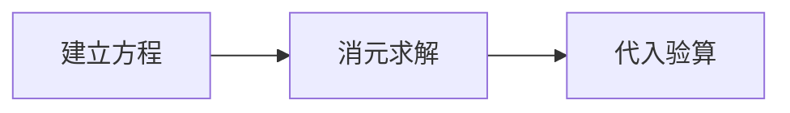

# 线性方程组

二元一次方程组可以写成矩阵形式：

$$
A\mathbf{x}=\mathbf{b}
$$

其中 $A$ 是系数矩阵，$\mathbf{x}$ 是未知量向量，$\mathbf{b}$ 是常数向量。

:::tip 继续探索
后续可以在这里加入 Mermaid 图、Vega-Lite 图表或一个矩阵变换 demo。
:::

:::chart bar 解题步骤耗时（分钟）
建模: 8
消元: 12
验算: 5
:::



```vega-lite
{
  "$schema": "https://vega.github.io/schema/vega-lite/v5.json",
  "description": "解题步骤耗时",
  "data": {"values": [
    {"step": "建模", "minutes": 8},
    {"step": "消元", "minutes": 12},
    {"step": "验算", "minutes": 5}
  ]},
  "mark": "bar",
  "encoding": {
    "x": {"field": "step", "type": "nominal"},
    "y": {"field": "minutes", "type": "quantitative"}
  }
}
```
